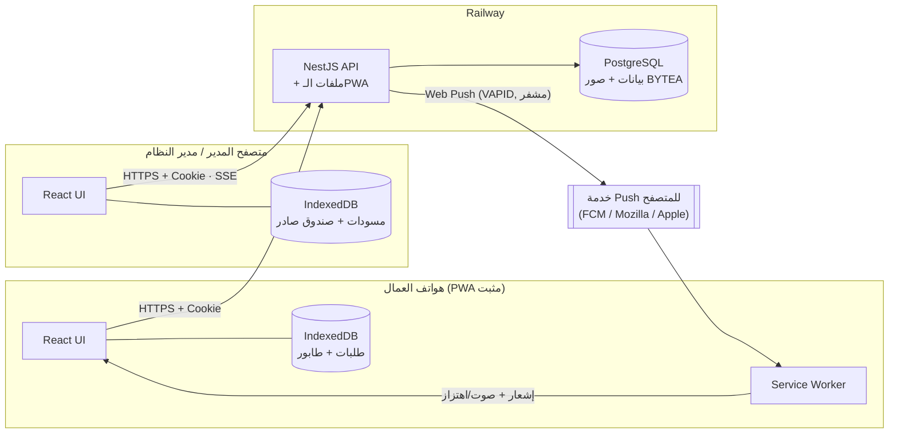
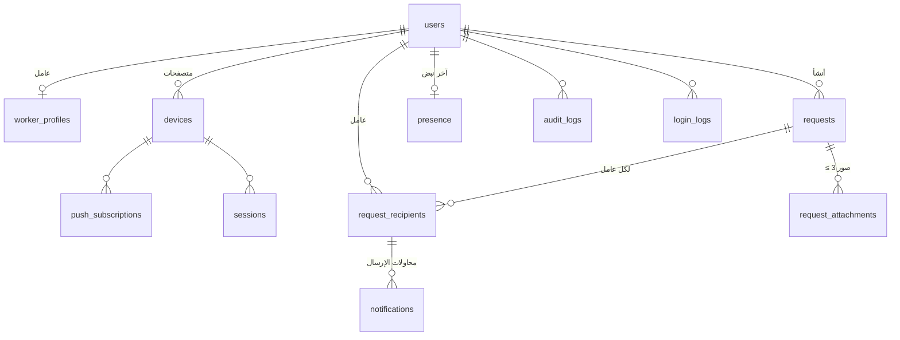
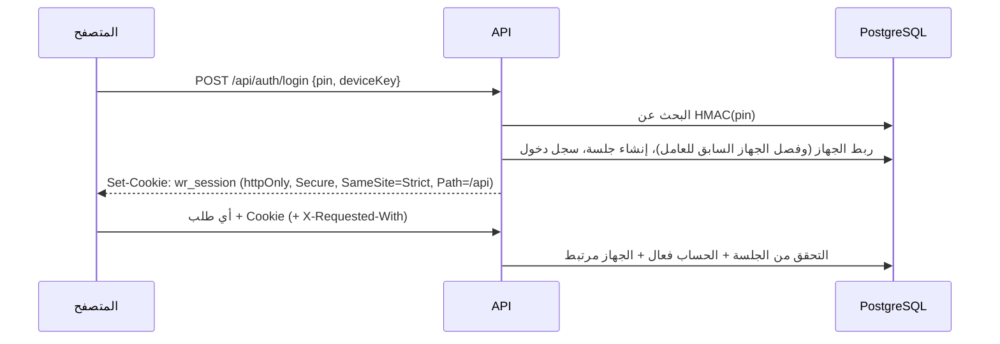
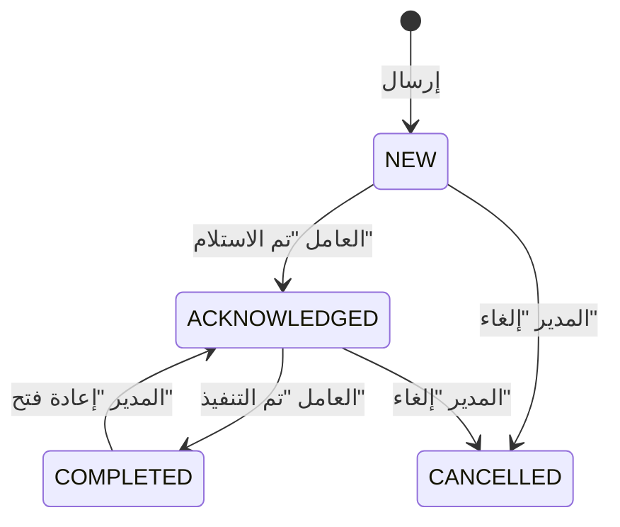
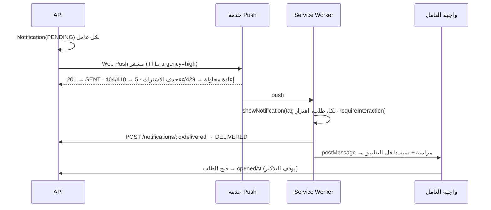

# البنية المعمارية

## نظرة عامة



- **خدمة واحدة**: NestJS يقدم الـAPI تحت `/api` ويقدم ملفات الـPWA المبنية من نفس النطاق. لا حاجة لـCORS، ويمكن استخدام Cookie من نوع `SameSite=Strict`.
- **قاعدة بيانات واحدة**: PostgreSQL على Railway.
- **الإشعارات**: Web Push القياسي (RFC 8030 + VAPID RFC 8292). المتصفح يختار خدمة الدفع الخاصة به (Chrome/Android → FCM، Firefox → Mozilla، Safari/iOS → Apple). لا يحتاج النظام مشروع Firebase. التفاصيل في [WEB_PUSH.md](WEB_PUSH.md).

## Backend (NestJS)

```
src/
├─ auth/                 تسجيل الدخول بالـPIN، الجلسات (Cookie)، تسجيل الخروج
├─ users/                أدوات مشتركة للحسابات (تفرد الـPIN)
├─ roles/                تعريف الأدوار وصلاحياتها (للعرض)
├─ workers/              إدارة العمال + الصورة
├─ managers/             إدارة المدراء ومديري النظام (لمدير النظام فقط)
├─ devices/              ربط المتصفح/الجهاز بالحساب + اشتراكات Web Push
├─ requests/             الطلبات من جهة المدير: إنشاء/تعديل/إلغاء/إعادة إرسال/إعادة فتح/بحث
├─ request-recipients/   الطلبات من جهة العامل: مزامنة، فتح، استلام، تنفيذ (+ آلة الحالات)
├─ attachments/          رفع الصور على مرحلتين، الضغط بـ sharp، القراءة المحمية
├─ notifications/        إرسال الإشعارات، تتبع الحالة، إعادة المحاولة، التذكير
├─ push/                 مزود Web Push (VAPID)
├─ presence/             نبض الاتصال، متصل / آخر اتصال
├─ audit/                سجل العمليات + سجل الدخول (للقراءة فقط)
├─ settings/             إعدادات النظام (قائمة مسموحة ومُتحقق منها)
├─ events/               بث لحظي للوحة التحكم (Server-Sent Events)
├─ dashboard/            إحصائيات لوحة التحكم
├─ common/               الحراس (Guards)، معالج الأخطاء، رموز الأخطاء العربية، أدوات الأمان
└─ prisma/ · config/ · health/ · cli/
```

**مسار كل طلب HTTP:**
`Throttler (تحديد المعدل)` ← `SessionAuthGuard (CSRF + الجلسة)` ← `RolesGuard (RBAC)` ← `ValidationPipe (DTO)` ← Controller ← Service ← Prisma.

- **RBAC "ممنوع افتراضيًا"**: أي endpoint بدون `@Roles(...)` أو `@Public()` مرفوض للجميع.
- **الأخطاء**: كل خطأ يعود بصيغة `{ statusCode, code, message (عربي), details? }`. لا تُعرض stack traces أبدًا، وتُسجل في الخادم فقط.
- **المهام الخلفية** (`@nestjs/schedule`): التذكير كل 30 ثانية، إعادة محاولة الإشعارات كل 15 ثانية، تنظيف الصور اليتيمة كل ساعة. مصممة لنسخة واحدة من الخادم (إعداد Railway الافتراضي).

## قاعدة البيانات



| الجدول | الغرض |
|---|---|
| `users` | كل الحسابات: `role` (SYSTEM_ADMIN / MANAGER / WORKER)، `pin_hash` (HMAC، فريد)، `is_active`، `deleted_at` (حذف ناعم) |
| `worker_profiles` | بيانات العامل فقط: الهاتف، الصورة (BYTEA) |
| `devices` | متصفح/PWA مرتبط بحساب. للعامل جهاز فعال واحد فقط |
| `push_subscriptions` | اشتراك Web Push لكل جهاز (endpoint + مفاتيح التشفير) |
| `sessions` | جلسات الخادم (HMAC للرمز فقط)، مرتبطة بالجهاز |
| `requests` | الطلب: العنوان، المنشئ، نوع الاستهداف، `idempotency_key`، `version` |
| `request_recipients` | **حالة مستقلة لكل عامل** + كل الأوقات (delivered/opened/acknowledged/completed/cancelled/reopened) + `state_version` |
| `request_attachments` | الصور بعد الضغط (WebP) + صورة مصغرة، داخل PostgreSQL |
| `notifications` | كل محاولة إشعار: النوع، الحالة (PENDING/SENT/DELIVERED/FAILED/SKIPPED)، المحاولات |
| `presence` | آخر نبض فقط (لا يوجد سجل تاريخي). حقول موقع محجوزة للمستقبل وغير مستخدمة |
| `audit_logs`, `login_logs` | سجلات للإضافة فقط — Trigger يمنع UPDATE/DELETE |
| `settings` | قيم الإعدادات المسموحة |

**ملاحظات تصميم:**
- **الأدوار** نوع `enum` ثابت في الكود (وليست جدولًا قابلًا للتعديل)، لأن الصلاحيات مفروضة بالكود. "إدارة الصلاحيات" = تعيين دور الحساب.
- **جدول `users` موحد** مع جدول ملحق للعامل بدل جداول منفصلة للمدراء والعمال، لتجنب تكرار البيانات (الاسم، الحالة، الـPIN، السجلات).
- **التوقيت**: كل الأوقات `timestamptz(3)` (UTC بدقة الميلي ثانية) **من ساعة الخادم**، ولا يُستخدم وقت الجهاز في العمليات المهمة. وقت ضغط العامل وهو Offline يُحفظ للمعلومية فقط في سجل العمليات.
- **لا حذف للسجلات المهمة**: العمال والمدراء يُعطلون أو يُحذفون حذفًا ناعمًا (`deleted_at`)، والطلبات تُلغى ولا تُحذف، وجميع المفاتيح الأجنبية `ON DELETE RESTRICT`.
- **قيود إضافية في الـmigration**: عنوان غير فارغ، ترتيب الصور 0..2، صيغة hash للـPIN، تفرد (طلب، ترتيب صورة).

## المصادقة والجلسات



- **PIN فقط** لكل الأدوار. الـPIN فريد على مستوى النظام كله (شاشة دخول واحدة). يُخزن `HMAC-SHA256(AUTH_SECRET, pin)`: البحث المباشر يتطلب نتيجة ثابتة، والـsalt العشوائي لا يسمح بذلك، والمفتاح السري يجعل القيمة المخزنة بلا فائدة بدونه.
- **الجلسة** رمز عشوائي 256 bit في Cookie لا يمكن لـJavaScript قراءته. تُحدّث مدتها تلقائيًا مع الاستخدام (العامل 60 يومًا، المدراء 7 أيام).
- **التحقق في كل طلب**: الجلسة غير ملغاة، والحساب فعال، والجهاز ما زال مرتبطًا. لذلك تعطيل عامل أو "فصل الجهاز" يسري **فورًا**.
- **CSRF**: الـCookie من نوع `SameSite=Strict`، وأي طلب يغيّر البيانات يحتاج ترويسة `X-Requested-With` (لا يمكن إرسالها من موقع آخر دون CORS)، ويُرفض أي `Origin` غريب.
- **Brute force**: 10 محاولات/دقيقة و60/ساعة لكل IP لنقطة الدخول، دون قفل الحسابات (حسب المتطلبات).
- **الأجهزة**: كل متصفح يولّد `deviceKey` عشوائيًا. دخول العامل من جهاز جديد يفصل الجهاز السابق (جلساته واشتراك الإشعارات). وإذا استُخدم نفس المتصفح لحساب عامل آخر، يُفصل الحساب الأول عنه حتى لا تصل طلباته إلى هاتف شخص آخر.

## دورة حياة الطلب



الحالة **لكل عامل** (`request_recipients`) وليست للطلب كله: «أحمد — تم التنفيذ، محمد — تم الاستلام، محمود — جديد».

| العملية | ماذا يحدث |
|---|---|
| **إرسال** | الصور تُرفع أولًا (كل صورة بمعرّف `clientUploadId` حتى لا تتكرر عند إعادة المحاولة)، ثم `POST /requests` مع `idempotencyKey`. داخل transaction واحد: إنشاء الطلب، وسجل لكل عامل، وربط الصور، وسجل العمليات. بعد الحفظ تُرسل الإشعارات في الخلفية ويُبث الحدث للوحة التحكم. |
| **منع التكرار** | `(المدير، idempotencyKey)` فريد في قاعدة البيانات. النقر المزدوج أو إعادة المحاولة أو إعادة الإرسال من الطابور يعيد نفس الطلب. |
| **تعديل** | العنوان و/أو الصور. يرفع `version` ويسجل `editedAt`، ويحدّث نسخة العامل، ويرسل إشعار «تم تعديل الطلب»، ويُسجل في سجل العمليات (قبل/بعد). |
| **إلغاء** | الطلب → `CANCELLED`، والعمال الذين لم ينفذوا → `CANCELLED`، والمنفذ يبقى منفذًا. لا يُحذف أي شيء. يُرسل إشعار إلغاء يُغلق إشعار الطلب على الهاتف. |
| **إعادة إرسال** | ينشئ **طلبًا جديدًا** (`resentFromId`) بنفس العنوان ونسخة من الصور لنفس العمال الفعالين. الطلب الأصلي لا يتغير. |
| **إعادة فتح** | `COMPLETED → ACKNOWLEDGED` للعمال المحددين (أو كلهم). يُصفّر `completedAt` (والقيمة السابقة محفوظة في سجل العمليات)، ويرفع `stateVersion`، ويرسل إشعارًا. |
| **فتح / استلام / تنفيذ** | أوقات الخادم بالثواني. لا يمكن «تم التنفيذ» قبل «تم الاستلام»، ولا يمكن التراجع. |

## الإشعارات (Web Push)



- **إشعار مستقل لكل طلب**: الـ`tag` = الطلب، فطلبان مختلفان لا يندمجان. أما تذكير أو تعديل **نفس** الطلب فيعيد تنبيه نفس الإشعار (`renotify`) بدل تكديس الإشعارات.
- **تبقى ظاهرة** حتى يتعامل العامل معها: `requireInteraction` (على المنصات التي تدعمها).
- **التذكير**: إذا بقي الطلب «جديد» ولم يُفتح لمدة 5 دقائق يُرسل تذكير، وبحد أقصى 3 تذكيرات (قابل للتعديل من الإعدادات). لا توجد إشعارات لا نهائية.
- **إعادة المحاولة**: الأخطاء المؤقتة تُعاد بتأخير 30 ثانية ثم دقيقتين، وبحد أقصى 3 محاولات.
- **تنظيف الاشتراكات**: رد 404/410 من خدمة الـPush يعطل الاشتراك فورًا. وإذا جدد المتصفح الاشتراك (`pushsubscriptionchange`) يسجله الـService Worker تلقائيًا.
- **العامل بدون اشتراك أو جهاز**: يُسجل الإشعار `SKIPPED` مع السبب، ويبقى الطلب على الخادم ويظهر للعامل عند المزامنة.

## الـPWA والـService Worker (`web/src/sw.ts`)

| الوظيفة | التنفيذ |
|---|---|
| App shell / Offline | Workbox precache لكل الملفات المبنية + `NavigationRoute` إلى `index.html`، فأي صفحة تفتح بدون إنترنت |
| الصور Offline | `CacheFirst` للصور المحمية (`/api/attachments/*`) في cache خاص يُمسح عند تسجيل الخروج أو تغيير الحساب |
| Push | `push` → `showNotification` + إيصال استلام + رسالة للنافذة المفتوحة |
| النقر على الإشعار | يفتح الطلب نفسه (`/worker/requests/:id`)، ويستخدم النافذة المفتوحة إن وجدت |
| Background Sync | `sync-queue`: يرسل عمليات العامل أو طلبات المدير المعلقة حتى لو أُغلق التطبيق (Chromium) |
| التحديث | `registerType: prompt`: يظهر شريط «يتوفر تحديث» ولا يُعاد تحميل الصفحة وسط عملية. `cleanupOutdatedCaches` يحذف الكاش القديم |
| التثبيت | `manifest.webmanifest` (standalone, rtl, ar، أيقونات عادية وmaskable) + زر «تثبيت التطبيق» عند توفر `beforeinstallprompt`، وتعليمات iOS |

## الـOffline والمزامنة

### العامل — طابور العمليات (`web/src/offline/worker-sync.ts`)

1. الواجهة تُعرض **دائمًا** من IndexedDB، فتعمل بدون إنترنت.
2. «تم الاستلام» / «تم التنفيذ» / الفتح: تحديث محلي فوري + إضافة عملية للطابور (`pending_acknowledge` / `pending_complete`) مع `baseStateVersion` (الإصدار الذي رآه العامل).
3. عند عودة الإنترنت (حدث `online`، فتح التطبيق، كل دقيقة، Background Sync، وصول Push) تُرسل العمليات **بالترتيب**.
4. **سياسة التعارض** (يقررها الخادم في `recipient-transitions.ts`):
   - إذا ألغى المدير الطلب أو أعاد فتحه بعد عملية العامل، يتغير `stateVersion` ويرد الخادم **409** مع حالته الحالية، فتُحذف العملية المحلية وتُعتمد حالة الخادم ويظهر تنبيه للعامل. الجهاز Offline لا يكتب فوق حالة أحدث أبدًا.
   - إعادة إرسال عملية نُفذت سابقًا = نجاح بلا أثر (idempotent)، فلا تتكرر في سجل العمليات.
   - الأخطاء المؤقتة (شبكة، 5xx، 429): تبقى العملية وتتوقف المعالجة للحفاظ على الترتيب.
5. سحب البيانات تزايدي: `GET /worker/requests?since=<serverTime>` يعيد الجديد والمعدل والملغى فقط.

### المدير — صندوق الصادر (`web/src/offline/outbox.ts`)

- نموذج «إرسال طلب» يُحفظ كمسودة تلقائيًا (العنوان، العمال، الصور المضغوطة).
- «إرسال» يحفظ الطلب أولًا في IndexedDB (`pending_request` + `pending_upload` لكل صورة) ثم يحاول الإرسال.
- إذا انقطع الإنترنت قبل الرفع أو أثناءه يبقى الطلب محفوظًا: تُعرض قائمة «طلبات بانتظار الإرسال» ويُعاد الإرسال تلقائيًا. الصور المرفوعة سابقًا لا تُرفع مجددًا، والطلب لا يتكرر بفضل `idempotencyKey`.
- أخطاء التحقق (مثل عامل معطل) نهائية ولا تُعاد تلقائيًا، وتظهر للمدير مع زر إعادة المحاولة أو الحذف.

## Online / آخر اتصال

- واجهة العامل ترسل نبضًا (`POST /presence/heartbeat`) كل 60 ثانية **أثناء فتحها فقط** (قابل للتعديل). أي نشاط آخر (مزامنة، استلام) يُحتسب أيضًا.
- «متصل» = آخر نبض خلال 150 ثانية (قابل للتعديل). غير ذلك يُعرض «آخر اتصال منذ X».
- **قيد حقيقي**: الـPWA المغلق لا يستطيع إرسال نبض في الخلفية، لذلك يظهر العامل «غير متصل» عند إغلاق التطبيق، مع أن الإشعارات ما زالت تصله. انظر WEB_PUSH.md.

## الموقع (مستقبلًا)

غير مفعل في هذه النسخة: لا خرائط ولا سجل مواقع ولا طلب صلاحية GPS. جدول `presence` يحتوي حقولًا محجوزة (آخر موقع فقط، يُستبدل ولا يُؤرشف) يمكن تفعيلها لاحقًا بإضافة حقلين اختياريين لنبض الاتصال وإعداد للتفعيل.
